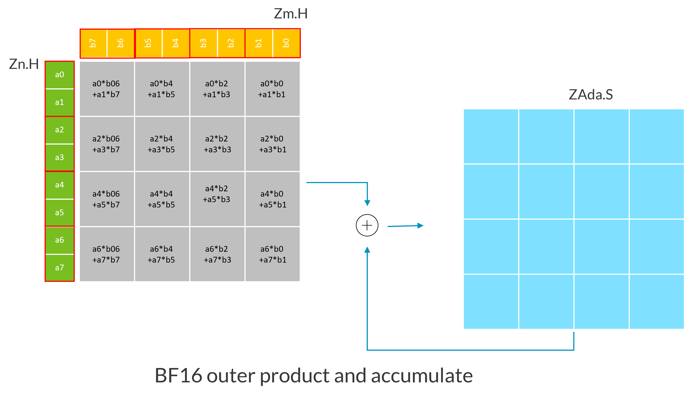
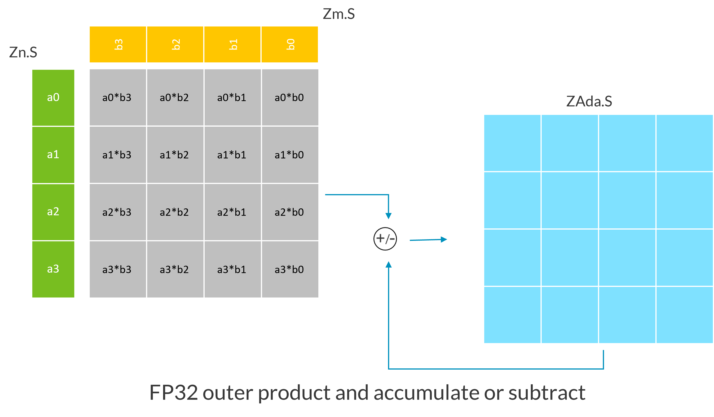
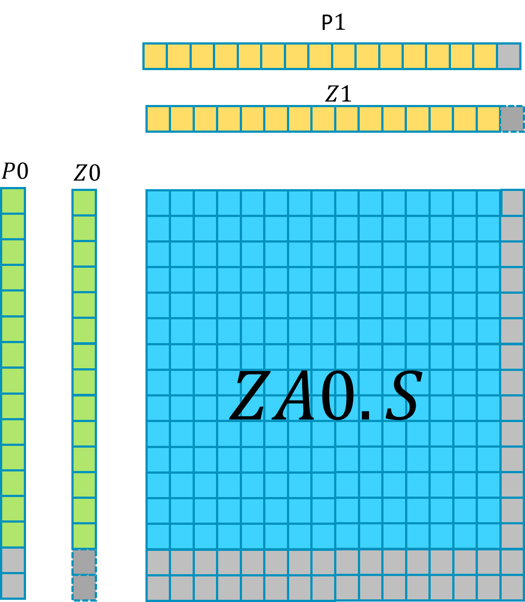
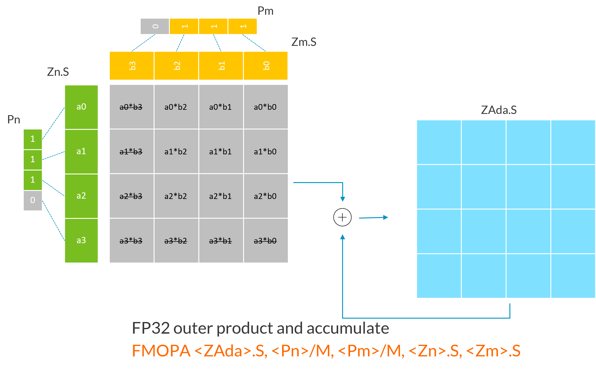
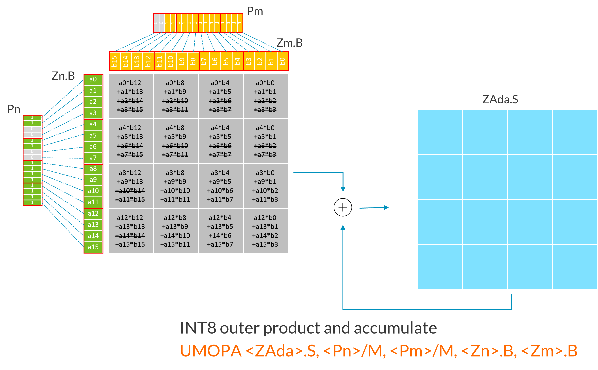
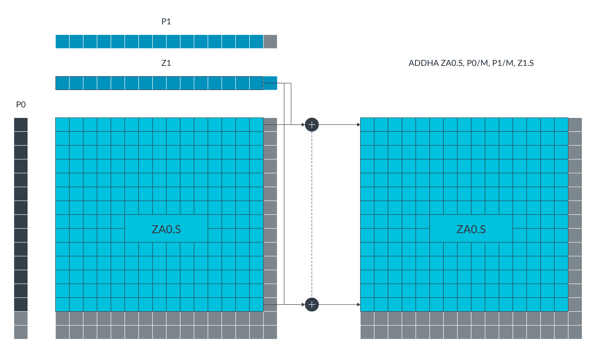
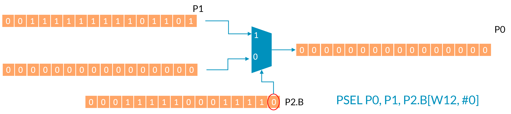
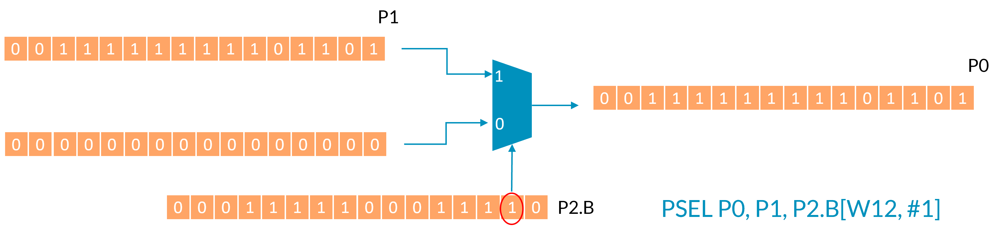

# ARM SME 指令

与 SME ZA 存储交互的 SME 指令包括以下内容：

- 将两个向量的外积累加或减去到 ZA 矩阵分块的指令；
- 在 ZA 矩阵分块行/列与向量之间传输的 Load/Store/Move 指令；
- 将向量水平或垂直方向加到 ZA 矩阵分块的指令；
- 在流式 SVE 模式下将向量大小的倍数加到标量寄存器的指令。

本博客的编写参考了基于以下 ARM 社区文章：
- [Part 1: Arm Scalable Matrix Extension (SME) Introduction](https://community.arm.com/arm-community-blogs/b/architectures-and-processors-blog/posts/arm-scalable-matrix-extension-introduction)
- [Part 2: Arm Scalable Matrix Extension (SME) Instructions](https://community.arm.com/arm-community-blogs/b/architectures-and-processors-blog/posts/arm-scalable-matrix-extension-introduction-p2)
- [Part 3: Matrix-matrix multiplication. Neon, SVE, and SME compared](https://community.arm.com/arm-community-blogs/b/architectures-and-processors-blog/posts/matrix-matrix-multiplication-neon-sve-and-sme-compared)

##### 1. 外积、累加与相减指令

使用向量内积和向量外积都可以完成矩阵的乘法，哪种方式更好，业界仍在积极讨论。SME 提供的是向量外积的方式，相比于内积，数据重用率更高，能有效减轻带宽压力。然而，向量外积需要使用更多的寄存器来保存中间结果，在 SME 中体现为 ZA 矩阵，这限制了向量的最大维度。

SME 的外积指令会计算向量寄存器 Zn 和 Zm 的外积，将结果数组与 ZA 分块（ZAda）中的现有的数据进行累加或相减，并将结果保存至同一个 ZA 分块。每个源向量由相应的谓词寄存器 Pn 和 Pm 控制。

| 输出数组 | 输入向量     | 描述                                                         | 示例                                                         |
| -------- | ------------ | ------------------------------------------------------------ | ------------------------------------------------------------ |
| INT32    | INT8, INT8   | 将四个 INT8 外积求和存入每个 INT32 元素                      | SMOPA/SMOPS/UMOPA/UMOPS：有符号或无符号整数外积求和并累加/减去。例如：<br>`UMOPS <ZAda>.S, <Pn>/M, <Pm>/M, <Zn>.B, <Zm>.B` |
| INT32    | INT16, INT16 | 将两个 INT16 外积求和存入每个 INT32 元素                     | SMOPA/SMOPS/UMOPA/UMOPS：有符号或无符号整数外积求和并累加/减去。例如： <br>`UMOPS <ZAda>.S, <Pn>/M, <Pm>/M, <Zn>.H, <Zm>.H` |
| INT64    | INT16, INT16 | 若实现 FEAT_SME_I16I64 特性，四个 INT16 外积之和将存入每个 INT64 元素 | SMOPA/SMOPS/UMOPA/UMOPS：带符号或无符号整数外积求和并累加/减去。例如： <br>`UMOPS <ZAda>.D, <Pn>/M, <Pm>/M, <Zn>.H, <Zm>.H` |
| FP32     | BF16, BF16   | 将两个 BF16 外积求和后存入每个 FP32 元素                     | BFMOPA 或 BFMOPS：BFloat16 外积求和累加或减法运算。例如： <br>`BFMOPS <ZAda>.S, <Pn>/M, <Pm>/M, <Zn>.H, <Zm>.H` |
| FP32     | FP16, FP16   | 将两个 FP16 外积求和后存入每个 FP32 元素                     | FMOPA 或 FMOPS：半精度浮点外积求和累加/减运算。例如： <br>`FMOPS <ZAda>.S, <Pn>/M, <Pm>/M, <Zn>.H, <Zm>.H` |
| FP32     | FP32, FP32   | 简单 FP32 外积运算                                           | FMOPA 或 FMOPS：浮点外积累加或减法运算。例如： <br>`FMOPS <ZAda>.S, <Pn>/M, <Pm>/M, <Zn>.S, <Zm>.S` |
| FP64     | FP64, FP64   | 若实现 FEAT_SME_F64F64 特性时的简易双精度浮点外积运算        | FMOPA 或 FMOPS：浮点外积累加或减法运算。例如： <br>`FMOPS <ZAda>.D, <Pn>/M, <Pm>/M, <Zn>.D, <Zm>.D` |

以下示例使用 SVL=128 位的 INT8 UMOPA 变体。INT8 变体计算四个 INT8 外积之和，将结果扩展为 INT32，然后将结果破坏性地累加或减去目标矩阵块。每个输入寄存器（Zn.B, Zm.B）被视为 4x4 元素矩阵，如同将每四个连续元素块（红色边框标注）进行转置处理。


以下示例使用 SVL=128 位的 BF16 FMOPA 变体。BF16 变体计算两个 BF16 外积之和，将结果扩展为 FP32，然后将结果破坏性地累加或减去目标矩阵块。



以下示例展示了 FP32 外积的累加或减法操作，输入与输出具有相同的数据类型，运算较为简单。



### 2. 支持谓词的 SME 指令

在 SME 中，每个源向量都由独立的谓词进行控制：

- 外积累加/减指令使用 Pn/M 和 Pm/M：非激活源元素被视为零值处理；
- 切片移动指令使用 Pg/M：目标切片中的非激活元素保持不变；
- 切片加载指令使用 Pg/Z：目标向量中的非激活元素会被置零；
- 切片存储指令使用 Pg：非激活元素不会写入内存。

谓词化使得处理矩阵维度不是 SVL 整数倍的情况变得更加容易。例如，考虑以下指令：



在这个例子中：

- SVL 为 512 位；
- Z 寄存器包含 16 个 FP32 向量；
- P0 中最后两个元素处于非激活状态；
- P1 中最后一个元素处于非激活状态。

该指令更新 ZA0.S 矩阵块中的(16-2)×(16-1)个 FP32 元素，由于使用了 Pn/M 掩码，ZA0.S 矩阵块的其余元素保持不变。

下图展示了更多谓词化外积指令的示例。删除线文本表示受非激活谓词元素影响的计算部分：





### 3. ZA 行/列的相加指令

SME 架构包含支持谓词化的指令，可将水平或垂直向量元素添加到 ZA 矩阵分块中：

| 指令  | 描述                               |
| ----- | ---------------------------------- |
| ADDHA | 将源向量加到 ZA 分块的每个水平切片 |
| ADDVA | 将源向量加到 ZA 分块的每个垂直切片 |

例如，`ADDHA ZA0.S, P0/M, P1/M, Z1.S` 指令将执行以下操作：



这条 ADDHA 指令将源向量 Z1 的每个元素与 ZA0.S 矩阵分块每个水平切片的对应激活元素相加。

矩阵分块元素受一对控制谓词约束。当某个水平切片元素在第二控制谓词中对应的元素为 TRUE，且其水平切片编号在第一控制谓词中对应的元素也为 TRUE 时，该元素被视为激活元素。目标矩阵块中的非激活元素保持不变。

### 4. 分块的加载、存储和移动指令

SME 的加载、存储和移动指令支持以下操作：

- 从内存加载 ZA 矩阵的行和列；
- 将 ZA 矩阵的行和列存储到内存；
- 将 ZA 矩阵行和列移动至 SVE Z 寄存器；
- 将 SVE Z 寄存器数据移动至 ZA 矩阵行和列。

##### 4.1 分块切片的加载和存储

LD1B、LD1H、LD1S、LD1D 和 LD1Q 指令分别将 8 位、16 位、32 位、64 位或 128 位元素的连续内存值加载到 ZA 分块切片中。ST1B、ST1H、ST1S、ST1D 和 ST1Q 指令分别将具有 8 位、16 位、32 位、64 位或 128 位元素的 ZA 分块切片存储到连续内存中。

这些指令还支持谓词操作，例如：

`LD1B ZA0H.B[W0, #imm], P0/Z, [X1, X2]`

这条 LD1B 指令执行谓词化连续字节加载操作，从内存地址 (X1+X2) 处将数据载入切片索引为 (W0+imm) 的 ZA0 水平分块切片。目标向量中非激活元素会被置零。

`ST1H ZA1V.H[W0, #imm], P2, [X1, X2, LSL #1]`

这条 ST1H 指令执行谓词化连续半字存储操作，将切片索引为 (W0+imm) 的 ZA1 垂直分块切片数据存储到起始地址为 (X1+X2*2) 的内存中。非激活元素不会被写入内存。

##### 4.2 分块切片的移动

MOV 指令（MOVA 的别名）用于将 Z 向量寄存器数据移动到 ZA 矩阵切片，或将 ZA 矩阵切片数据移动到 Z 向量寄存器。该指令在指定元素大小的命名 ZA 矩阵内，对单个水平或垂直切片进行操作。切片编号由切片索引寄存器值与立即数偏移量之和决定。目标切片中的非激活元素将保持不变。

例如：

`MOV ZA0H.B[W0, #imm], P0/M, Z0.B`

或者：

`MOVA ZA0H.B[W0, #imm], P0/M, Z0.B`

该指令使用 P0 作为谓词寄存器，将向量寄存器 Z0.B 移动到水平 ZA 分块切片 ZA0H.B[W0, #imm] 中。目标分块切片中的非激活元素保持不变。

##### 4.3 ZA 矩阵向量的加载和存储

SME LDR 指令将内存数据加载到 ZA 阵列向量中，SME STR 指令则将 ZA 阵列向量存储到内存中。这些指令是无条件执行的。为了上下文切换的目的，当 PSTATE.ZA 启用时，它们可在非流式 SVE 模式下使用。

例如，在以下 STR 指令中，ZA 阵列向量由向量选择寄存器与可选立即数之和选定。内存地址由标量基址加上相同的可选立即偏移量（乘以当前以字节为单位的向量长度）生成：

`STR ZA[<Wv>, <imm>], [<Xn|SP>{, #<imm>, MUL VL}]`

##### 4.4 ZA 矩阵清零指令

ZERO 指令用于将一组 64 位元素 ZA 分块清零：

`ZERO { <mask>}`

ZERO 指令根据掩码指定，将名为 ZA0.D 至 ZA7.D 的八个分块清零，其他分块保持不变。该指令可在 PSTATE.ZA 启用时用于非流式 SVE 模式。使用指令别名 `ZERO {ZA}` 可以清零整个 ZA 数组。

### 5. 新增 SVE2 指令

SME 架构新增了多条 SVE2 指令。若实现了 SVE2，这些指令在 PE 处于非流式 SVE 模式时也可使用。这些指令包括：

- 在谓词寄存器或全假值之间进行谓词选择；
- 对元素中的 64 位双字进行反转；
- 带符号与无符号的向量最小值/最大值钳位操作。

##### 5.1 PSEL 指令

PSEL 指令在谓词寄存器或全假值之间执行谓词选择，具体如下：

`PSEL <Pd>, <Pn>, <Pm>.<T>[<Wv>, <imm>]`

若第二个源谓词的索引元素为真，则该指令将第一个源谓词寄存器的内容存入目标谓词寄存器；否则将目标谓词设为全假值。

例如，假设 W12 为 0 时执行以下指令：

`PSEL P0, P1, P2.B[W12, #0]`

第二个源谓词 P2.B 的元素[W12+0]为假值。因此如图所示，P0 被置为全零状态：



现在假设 W12 仍为 0，但这次立即偏移量为 1，考虑以下指令：

`PSEL P0, P1, P2.B[W12, #1]`

第二个源谓词 P2.B 的元素[W12+1]为真。因此 P0 被设置为第一个源谓词寄存器 P1 的内容，如下图所示：



### 6. SME 编译选项

在程序中集成 SME 特性一般有两种方式：

- 编写汇编代码，使用 Arm 编译器或者 Clang 编译器直接生成可执行文件。
- 使用编译器支持的 SME intrisics 编写代码，编译器会直接使用相应的 SME 指令替换内联函数。

在程序中集成 SME 特性一般有两种方式：

- 编写汇编代码，使用Arm 编译器或者 Clang 编译器直接生成可执行文件。
- 使用编译器支持的 SME intrisics 编写代码，编译器会直接使用相应的 SME 指令替换内联函数。

在编译 SME 程序时，需要根据不同的变体选择 `-march` 选项：

| 功能标识符      | 功能描述                              | -march/-mcpu 选项 |
| --------------- | ------------------------------------- | ----------------- |
| FEAT_SME        | SME                                   | sme               |
| FEAT_SME2       | SME2                                  | sme2              |
| FEAT_SME_F64F64 | SME with the double-precision variant | sme-f64f64        |
| FEAT_SME_I16I64 | SME with 16-bit integer variant       | sme-i16i64        |
| ...             | ...                                   | ...               |

例如：

```bash
// Arm C/C++ compiler:
armclang --target=aarch64-arm-none-eabi -march=armv9.2-a+sme2 -o <Executable file> <source file>

// Clang compiler:
clang -target aarch64-none-elf -march=armv9.2-a+sme2 <Source files> -o <Executable files>
```

### 7. SME 调用约定

在使用汇编语言编程 SME 时，需要参考支持 SME 的 Arm 架构应用二进制接口（ABI）文档中 Arm 64 位架构过程调用标准（AAPCS64）。

根据 AAPCS64 标准，在使用 SME 特性进行矩阵运算时，一般使用前 8 个寄存器 `r0-r7` 用于向子程序传递参数值，并使用 `x0-x5` 传递输入矩阵的行列数值及矩阵指针，之后复用 `r0-r7` 用于从函数返回结果。此外，SME 定义了若干处理器状态： `ZA storage` 、 `PSTATE.SM` 、 `PSTATE.ZA` 和 `TPIDR2_EL0` 。更多的状态定义，请参考 [AAPCS64](https://github.com/ARM-software/abi-aa/blob/main/aapcs64/aapcs64.rst#the-base-procedure-call-standard)。

##### 7.1 流模式的使用

ABI 定义了函数入口和正常返回时 `PSTATE.SM` 的状态。处理器在任何时刻都处于流模式（ `PSTATE.SM==1` ）或非流模式（ `PSTATE.SM==0` ）之一。

在直接编写汇编代码时，使用指令 `SMSTART SM` 进入流模式。使用 `SMSTOP SM` 返回到非流模式。在使用 ACLE 内部函数编写 C/C++ 代码时，ACLE 提供了两个属性来指定程序执行语句的方式，分别是流模式（Streaming）和流兼容（Streaming-compatible）模式。

##### 7.2 ZA 存储的使用

ZA 存储的启用由处理器状态位 `PSTATE.ZA` 控制。与流模式类似，启用 ZA 存储有两种方式。第一种是通过直接在汇编中编写的 `SMSTART` 指令。第二种是使用带有 ACLE 内部函数的属性。在 C 和 C++代码中，对 ZA 的访问控制在函数粒度级别。AAPCS 为函数处理 ZA 提供了三种选择：

- 默认情况下，函数不使用 ZA 存储。
- 函数使用 ZA，并与调用者共享。
- 该函数使用其自行创建的 ZA 存储，并且不与调用者共享。

### 8. SME 编程示例

下面将通过两个示例来说明使用汇编语言与 C 语言代码实现两个 4 元素向量乘法，生成一个 4*4 矩阵。

##### 8.1 汇编代码

```assembly
    .global op
    .p2align 2
    .type op, "function"

 op:
    smstart
    PTRUE P0.S

    LD1W   {Z0.S}, P0/Z, [X0]

    LD1W   {Z4.S}, P0/Z, [X1]

    FMOPA ZA0.S, P0/M, P0/M, Z0.S, Z4.S

    mov w12, #0
    ST1W ZA0H.S[W12, #0], P0, [X2]
    mov w11, #4
    ST1W ZA0H.S[W12, #1], P0, [X2, X11, LSL #2]
    mov w11, #8
    ST1W ZA0H.S[W12, #2], P0, [X2, X11, LSL #2]
    mov w11, #12
    ST1W ZA0H.S[W12, #3], P0, [X2, X11, LSL #2]

    smstop
    ret
```

下面逐行解释上述汇编代码中使用的汇编指令：

1. `smstart` ：启用 ZA 存储矩阵并进入流式 SVE 模式。SME 指令只能在流式 SVE 模式下执行。
2. `PTRUE P0.S` ：初始化谓词寄存器 P0。由于本示例未使用谓词化，故将其设置为全真。我们需要初始化一个谓词寄存器，以满足后续 SME 指令的需要。
3. `LD1W {Z0.S}, P0/Z, [X0]` ：将第一个 4 元素输入向量加载到单个向量寄存器中。其中：
   - `Z0.S` ：目标寄存器的名称， `Z0` 。其中 `.S` 表示该寄存器包含 32 位元素。
   - `P0/Z` ：谓词寄存器的名称， `P0/Z` 表示非激活元素被清零，但在本例中所有元素始终处于激活状态。
   - `X0` ：内存中第一个输入向量 A 的地址。 `X0` 、 `X1` 、 `X2` 分别代表向量 A、向量 B 和结果矩阵。
4. `FMOPA ZA0.S, P0/M, P0/M, Z0.S, Z4.S` ：该指令计算第一个源向量与第二个源向量的外积：
   - `ZA0.S` ：结果矩阵存储的 ZA 分块名称，ZA0.S 表示其包含 32 位元素。
   - `P0/M` ：谓词寄存器名称。与 LD1W 指令相同，该谓词寄存器被设置为全真。
   - `Z0.S` 和 `Z4.S` ：包含输入向量的两个向量寄存器，由之前的 `LD1W` 指令加载。这些是 `FMOPA` 指令执行操作时使用的源向量寄存器。该操作计算由 `LD1W` 指令加载的两个源向量寄存器的外积。
5. `mov w12, #0` ：为每条 ST1W 指令设置地址偏移量。其中：
   - `w12` 是包含偏移量的寄存器。
   - `#0` 是一个表示偏移量的整数值。对于第一条指令，偏移量为零，因此向量元素被存储到地址 `X2 + 0` ，即 `X2` 。对于后续的 `ST1W` 指令，偏移量每次增加 4。
6. `ST1W ZA0H.S[W12, #1], P0, [X2, X11, LSL #2]` ：该指令将结果矩阵的单个行存储在分块 `ZA0` 中，并按顺序将元素值存储到内存中。 `ST1W` 指令可以垂直或水平访问分块值。在此情况下，采用水平方式访问。
   - `ZA0H.S` ：与 `LD1W` 指令类似， `ZA0` 表示 ZA 瓦片的名称， `.S` 指定元素为 32 位。该操作数中的 `H` 指定了在瓦片内水平访问值。也就是说，我们以行优先格式而非列优先格式存储结果矩阵。
   - `W12, #1` ：共同指定了正在存储的行号。在此示例中， `W12` 始终为 0，因此这指定了第 1 行。
   - `P0` ：是谓词寄存器，在此示例中设置为全真。
   - `X2` ：结果矩阵在内存中存储的基地址。
   - `X11, LSL #2` ：共同指定一个偏移量，该偏移量与基地址 `X2` 相加，得到该指令要存储的第一个元素的内存地址。第一条 `ST1W` 指令使用的偏移量为 0，随后的 `ST1W` 指令将偏移量每次增加 4。 `LSL #2` 将寄存器值的位左移 2 位，相当于将值乘以 4。
7. `smstop` ：退出 SVE 流模式。
8. `ret` ：从子程序返回。

总结一下，矩阵乘法的一般流程为：使用 `LD1W` 将输入数组值加载到两个向量寄存器中，然后使用 `FMOPA` 计算两个向量寄存器外积的结果矩阵并存入 ZA 分块，最后使用 `ST1W` 将结果矩阵存储到内存中。

##### 8.2 C 代码

```c
#include <stdio.h>
#include <stdlib.h>
#include <inttypes.h>
#include <math.h>
#include <arm_sve.h>

extern void op( const float_t * restrict ,  const float_t * restrict, const float_t * restrict );

float_t main(int argc, char **argv)
{
    int y;

    float_t * vec_a = (float_t *) malloc(4*sizeof(float_t));
    float_t * vec_b = (float_t *) malloc(4*sizeof(float_t));
    float_t * result_matrix = (float_t *) malloc(16*sizeof(float_t));

    vec_a[0] = 7.0;
    vec_a[1] = 3.0;
    vec_a[2] = 6.0;
    vec_a[3] = 9.0;

    vec_b[0] = 4.0;
    vec_b[1] = 2.0;
    vec_b[2] = 1.0;
    vec_b[3] = 5.0;

    for (y=0; y<16; y++) {
        result_matrix[y] = 0;
    }

    op(&vec_a[0], &vec_b[0], &result_matrix[0]);

    printf("Vector A:\n");
    for (y=0; y<4; y++) {
                printf("  %4.0f\n", vec_a[y]);
    }

    printf("Vector B:\n");
    for (y=0; y<4; y++) {
                printf("  %4.0f\n", vec_b[y]);
    }

    printf("Result matrix:\n");
    for (y=0; y<16; y+=4) {
                printf("%4.0f  %4.0f  %4.0f  %4.0f\n", result_matrix[y], result_matrix[y+1], result_matrix[y+2], result_matrix[y+3]);
    }

    return 0;
}
```

上述 C 代码执行了以下三个操作：

1. 定义并初始化三个数组：
   - `Vec_a` 和 `vec_b` 是输入向量。每个向量都是一个包含 4 个浮点数值的数组。
   - `Result_matrix` 是结果矩阵，初始化为包含 16 个值的数组，所有值均初始化为零。
2. 调用汇编函数 `op` ，传入 `vec_a` 、 `vec_b` 和 `result_matrix` 的内存地址。ARM ABI 规定这些参数分别通过寄存器 `X0` 、 `X1` 和 `X2` 传递。
3. 使用 `printf` 将两个向量及结果矩阵的值输出到控制台。

