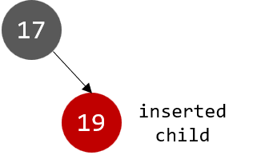
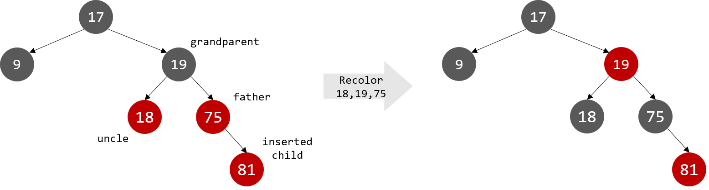
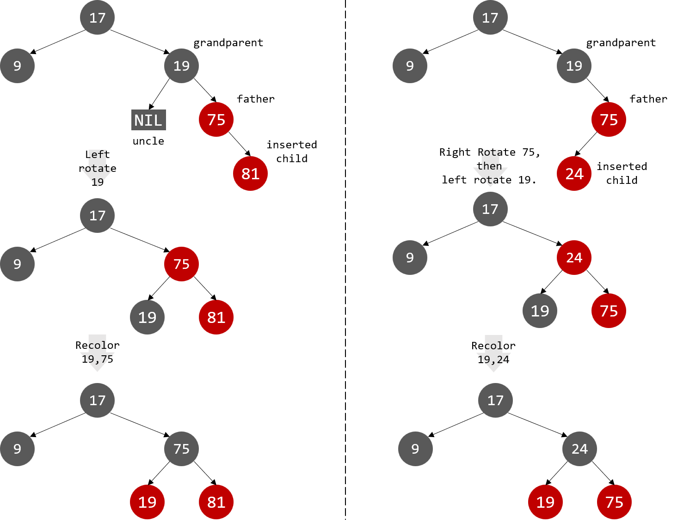

# 红黑树 Red Black Tree

在动态数据结构中，如何在保持查询效率的同时，实现快速的插入和删除操作，是一个核心问题。**红黑树（Red-Black Tree）**是一种经过优化的二叉搜索树，具有高效的自平衡机制，能在最坏情况下提供 $O(\log{n})$ 的操作性能。

红黑树因其实现简单、性能稳定而被广泛应用于操作系统、数据库等领域。本文将全面介绍红黑树的特点、操作和实现。


### 1. 什么是红黑树

红黑树是一种平衡二叉搜索树，通过给每个节点着色并在插入或删除节点后调整树的结构来保持平衡。其核心特性是：

- **节点的颜色**：每个节点要么是红色，要么是黑色。根节点为黑色。空叶子节点为黑色。
- **红色节点不能连续出现**：红色节点的子节点必须是黑色（即没有两个连续的红色节点）。
- **每个节点到其子孙节点的所有路径上，黑色节点数量相同**（黑高平衡）。

这些规则确保了红黑树的高度始终接近 $O(\log{n})$，从而保证操作的高效性。


### 2. 红黑树的基本操作

**2.1 插入操作**

在红黑树中插入节点后，可能导致树不满足红黑规则。为了解决这一问题，需要：

1. **按照二叉搜索树规则插入节点**，插入的节点为**红色**；
2. 根据插入位置的颜色和关系进行修复：
   - **重新着色**：调整父节点、祖父节点和叔叔节点的颜色；
   - **旋转操作**：通过左旋或右旋恢复树的平衡。

插入的调整规则通常分为以下几种情况：

- **Case 1：插入的父节点是黑色**
  树仍满足红黑树规则，无需调整。
  
  

- **Case 2：插入的父节点是红色，且叔叔节点也是红色**
  重新着色，将父节点和叔叔节点变为黑色，祖父节点变为红色；如果祖父节点是根节点，则变为黑色。递归进行重新着色的过程，传递到根节点，整棵树变为标准的红黑树。

  

- **Case 3：插入的父节点是红色，且叔叔节点是黑色**
  根据插入位置分为 LL 型、LR 型、RL 型、RR 型，通过旋转操作恢复平衡。在最后一次旋转之前交换旋转轴两侧节点的颜色，以满足红黑树的颜色要求。

  

**2.2 查询操作**

红黑树的节点查找操作与二叉搜索树一致。


### 3. 红黑树的复杂度分析

- 时间复杂度：红黑树的建树时间复杂度为 $O(n)$；由于树的高度始终保持在 $O(\log{n})$，查找、插入、删除节点的时间复杂度都是 $O(\log{n})$。
- 空间复杂度：$O(n)$。


### 4. 红黑树的模板

```c++
enum Color { RED, BLACK };

struct Node {
    int key;
    Color color;
    Node* left;
    Node* right;
    Node* parent;

    Node(int val) : key(val), color(RED), left(nullptr), right(nullptr), parent(nullptr) {}
};

Node* root;

Node* rightRotate(Node* n) {
    Node* lnode = n->left;
    Node* rnode = n->right;
    
    n->left = lnode->right;
    if (lnode->right)
        lnode->right->parent = n;
    lnode->parent = n->parent;
    lnode->right = n;
    n->parent = lnode;
    
    return lnode;
}

Node* leftRotate(Node* n) {
    Node* lnode = n->left;
    Node* rnode = n->right;
    
    n->right = rnode->left;
    if (rnode->left)
        rnode->left->parent = n;
    rnode->parent = n->parent;
    rnode->left = n;
    n->parent = rnode;
    
    return rnode;
}

void fixInsert(Node* n) {
    while (n->parent && n->parent->color == RED) {
        Node* father = n->parent;
        if (n->parent == n->parent->parent->left) {
            Node* uncle = n->parent->parent->right;
            if (uncle && uncle->color == RED) {
                uncle->color = BLACK;
                father->color = BLACK;
                father->parent->color = RED;
                n = father->parent;
            } else {
                if (n == father->right) {
                    n = father;
                    leftRotate(n);
                }
                father = n->parent;
                father->color = BLACK;
                father->parent->color = RED;
                rightRotate(father->parent);
            }
        } else {
            Node* uncle = n->parent->parent->left;
            if (uncle && uncle->color == RED) {
                uncle->color = BLACK;
                father->color = BLACK;
                father->parent->color = RED;
                n = father->parent;
            } else {
                if (n == father->left) {
                    n = father;
                    rightRotate(n);
                }
                father = n->parent;
                father->color = BLACK;
                father->parent->color = RED;
                leftRotate(father->parent);
            }
        }
    }
    root->color = BLACK;
}

void insert(int key) {
    Node* n = new Node(key);
    Node* parent = nullptr;
    Node* x = root;
    
    while (x) {
        parent = x;
        if (z->key < x->key) {
            x = x->left;
        } else {
            x = x->right;
        }
    }
    
    n->parent = parent;
    if (!parent) {
        root = n;
    } else if (n->key < parent->key) {
        parent->left = n;
    } else {
        parent->right = n;
    }
    
    fixInsert(n);
}

void inorder(Node* node) {
    if (!node)
        return;
    inorder(node->left);
   	std::cout << node->key << " ";
    inorder(node->right);
}
```


### 5. AVL 树 vs. 红黑树

AVL 树是严格的平衡二叉搜索树，左右子树的高度一定不超过 1。只要插入或者删除操作导致左右子树高度不平衡，则需要通过旋转来维持平衡。因此 AVL 树适合插入和删除操作较少，但查询操作较多的使用场景。

红黑树是一种弱平衡二叉搜索树，相较于 AVL 树的旋转次数较少。因此红黑树适合插入和删除操作较多的使用场景。
