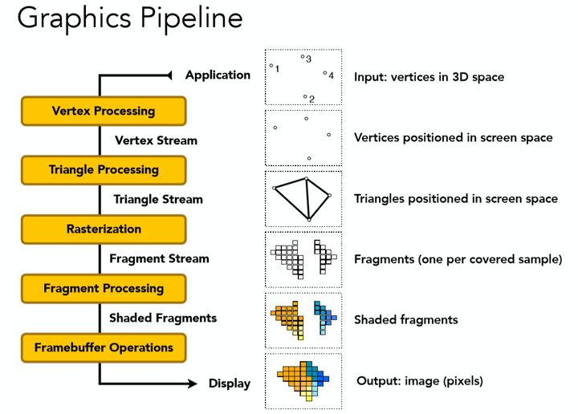

# 渲染管线加速

在现代计算机图形学中，**渲染管线**（Rendering Pipeline）是将三维场景转换为二维图像的核心流程。无论是游戏、影视特效还是虚拟现实，渲染管线都扮演着至关重要的角色。本文将深入解析图形渲染管线的关键步骤、工作原理以及其在 FPGA 中的实现。


### 1. 什么是渲染管线

通常来说，渲染管线可以分为应用、几何、光栅化三个阶段。

**1.1 应用阶段**

这一阶段是渲染管线的起点，可以对准备的场景数据（如顶点坐标）和设置的渲染状态（如纹理材质）等进行优化。比如，可以应用一些剔除算法（culling）去除摄像机不可见的物体，减少需要渲染的物体数量。在传统的渲染管线中，这一阶段一般在 CPU 中执行。

**1.2 几何阶段**

这一阶段主要负责将三维的几何数据转换为适合光栅化梳理处理的形式，可以分为顶点着色、投影、裁剪和屏幕映射四个主要步骤。

**顶点着色（Vertex Shading）**的主要任务是对每个顶点的属性进行变换和操作。首先，各个物体处于自己的模型坐标系（Object Space）中，需要将它们的坐标转换到世界坐标系（World Space）之中进行统一计算，这一过程称为模型变换。接着，各个世界坐标系会被转换到虚拟相机对应的视空间（View Space）中，观察方向的正方向为 -z 轴，正上方为 +y 轴，正右方为 +x 轴。视点、视线以及远近平面会组成一个视锥（View Frustum），视锥内的物体会被**投影（Projection）**到近平面中，即三维到二维的映射过程。投影一般使用正交投影和透视投影两种方式。

**视锥裁剪（Clipping）**用于裁剪视锥之外的物体，以提升渲染效率。如果一个物体完全在视锥之外，那么这个物体完全不需要渲染，直接进行裁剪即可。如果一个物体的一部分在视锥之内，另一部分在视锥之外，那么需要在视锥体与线段的交界之处构建新顶点以代替视锥之外的顶点。在视锥之内的图元（如点、线段、三角形）才能执行**屏幕映射（Screen Mapping）**步骤，这里会把每个图元的坐标转换为屏幕坐标系，这与屏幕分辨率相关。

**1.3 光栅化阶段**

光栅化阶段是图形渲染管线中的核心部分，负责将几何阶段输出的图元转换为屏幕上的像素片段，并为每个像素片段计算颜色、深度等属性。光栅化阶段在 GPU 上高度并行化，是实现实时图形渲染的关键。

光栅化阶段的首个主要任务是将几何图元**光栅化（Rasterization）**为片元，即将它们离散化并映射到屏幕像素网格中，确定哪些像素被图元覆盖。这一步骤基于图元的屏幕坐标和像素的边界关系。例如，对于三角形图元，光栅化过程需要判断每个像素中心点是否位于三角形内部。这种像素级的覆盖判断通常由硬件高效实现。通过这一过程，生成了一系列片元（Fragments），每个片段对应屏幕上的一个像素位置，并携带从几何阶段传递下来的插值属性（如颜色、纹理坐标和法线）。

接下来**片元着色器（Fragment Shader）**会对片元着色，最终决定屏幕上各个像素的颜色。最常见的两种着色技术分别是纹理贴图和光照计算。纹理贴图也称为纹理映射，它可以将图像信息映射到三角形网络上，以此来增加物体表面的细节，令物体更具有真实感。光照计算通过对漫反射、镜面反射和环境光等光照的计算，最终得出像素点的色值。

在片段颜色确定后，光栅化阶段的最后一个步骤是进行**透明度测试**、**深度测试**和**模板测试**等测试。这些测试用于确定当前片段是否应该写入帧缓冲区。

**1.4 帧缓冲**

光栅化阶段的结果将会输出到帧缓冲区。帧缓冲区主要包含**颜色缓冲区（Color Buffer）**和**深度缓冲区（Z-Buffer）**。当片元要写入帧缓冲区时，会与深度缓冲区中的像素比较深度，如果其深度小于 z-buffer 中的初始深度值，则该片元可以覆盖 color buffer 中对应像素的颜色值。最终我们屏幕上显示的内容就是 color buffer 中的值。为了避免画面撕裂，或者避免用户看到正在进行渲染的帧，GPU 上一般采用**双缓冲（Double Buffer）**技术。屏幕上显示的是前置缓冲区的内容，而渲染好的图元将被写入后置缓冲区。渲染完毕后交换两个缓冲区，如此交替进行。




### 2. FPGA 加速渲染管线

下面我们对 rosetta 基准测试 [1] 进行修改，在 FPGA 上加速渲染管线中的部分功能，将 3D 模型渲染为 2D 图像。

**2.1 投影**

第一阶段将世界坐标系中的三维三角形投影到二维画布上。这里使用的是正交投影，其变换矩阵为 $P= \left[ \begin{array}{ccc} 1 & 0 & 0 \\ 0 & 1 & 0 \\ 0 & 0 & 0 \end{array} \right]$。此外还需要记录三角形的 z 中心，用于深度缓冲的深度比较。这里设定相机位置为 $(0,0,-1)$，画布是 $z=0$ 平面，3D 模型位于 $z>0$ 空间

```c
void projection(hls::stream<Triangle3D> &triangle_3d_stream,
                hls::stream<Triangle2D> &triangle_2d_stream) {

    Triangle3D triangle_3d = triangle_3d_stream.read();
    Triangle2D triangle_2d;

    triangle_2d.x0 = triangle_3d.x0;
    triangle_2d.y0 = triangle_3d.y0;
    triangle_2d.x1 = triangle_3d.x1;
    triangle_2d.y1 = triangle_3d.y1;
    triangle_2d.x2 = triangle_3d.x2;
    triangle_2d.y2 = triangle_3d.y2;
    triangle_2d.z = triangle_3d.z0 / 3 + triangle_3d.z1 / 3 + triangle_3d.z2 / 3;

    triangle_2d_stream.write(triangle_2d);
}
```

**2.2 光栅化**

首先，在三角形的二维信息中，可以根据坐标算出三角形的边界框。接着，遍历边界框中的所有像素，使用 Pineda 算法判断其是否在三角形内，如果是，则标记为候选像素，等待后续帧缓冲的更新。

```c
void rasterization1(hls::stream<Triangle2D> &triangle_2d_stream,
                    hls::stream<Triangle2D> &triangle_2d_same_stream,
                    hls::stream<TriangleInfo> &triangle_info_stream) {

    Triangle2D triangle_2d = triangle_2d_stream.read();
    Triangle2D triangle_2d_same;
    TriangleInfo triangle_info;

    if (check_clockwise(triangle_2d) == 0)
        return;
    if (check_clockwise(triangle_2d) < 0)
        clockwise_vertices(&triangle_2d);

    triangle_2d_same.x0 = triangle_2d.x0;
    triangle_2d_same.y0 = triangle_2d.y0;
    triangle_2d_same.x1 = triangle_2d.x1;
    triangle_2d_same.y1 = triangle_2d.y1;
    triangle_2d_same.x2 = triangle_2d.x2;
    triangle_2d_same.y2 = triangle_2d.y2;
    triangle_2d_same.z = triangle_2d.z;

    triangle_info.minX = find_min(triangle_2d.x0, triangle_2d.x1, triangle_2d.x2);
    triangle_info.maxX = find_max(triangle_2d.x0, triangle_2d.x1, triangle_2d.x2);
    triangle_info.minY = find_min(triangle_2d.y0, triangle_2d.y1, triangle_2d.y2);
    triangle_info.maxY = find_max(triangle_2d.y0, triangle_2d.y1, triangle_2d.y2);
    triangle_info.width = triangle_info.maxX - triangle_info.minX;
    triangle_info.box = (triangle_info.maxX - triangle_info.minX) * (triangle_info.maxY - triangle_info.minY);
    triangle_info.flag = 0;

    triangle_2d_same_stream.write(triangle_2d_same);
    triangle_info_stream.write(triangle_info);
}

void rasterization2(hls::stream<Triangle2D> &triangle_2d_same_stream,
                    hls::stream<TriangleInfo> &triangle_info_stream,
                    hls::stream<Fragment> &fragment_stream) {

    Triangle2D triangle_2d_same = triangle_2d_same_stream.read();
    TriangleInfo triangle_info = triangle_info_stream.read();

    bit8 color = 100;

    for (bit16 k = 0; k < triangle_info.box; k++) {
#pragma HLS pipeline II = 1
        Fragment fragment;
        bit8 x = triangle_info.minX + k % triangle_info.width;
        bit8 y = triangle_info.minY + k / triangle_info.width;

        if (pixel_in_triangle(x, y, triangle_2d_same)) {
            fragment.x = x;
            fragment.y = y;
            fragment.z = triangle_2d_same.z;
            fragment.color = color;
            fragment_stream.write(fragment);
        }
    }
}
```

**2.3 帧缓冲更新**

首先，将候选像素的深度值，与 z-buffer 中对应位置的深度值进行比较，并更新 z-buffer。接着，根据比较的结果，决定是否更新 color buffer 中对应位置的颜色值。

```c
void zculling(bit16 index,
              hls::stream<Fragment> &fragment_stream,
              hls::stream<Pixel> &pixel_stream) {
    
    static bit8 z_buffer[MAX_X][MAX_Y];
    if (index == 0) {
        ZCULLING_INIT_ROW:for (bit16 i = 0; i < MAX_X; i++) {
#pragma HLS PIPELINE II = 1
            ZCULLING_INIT_COL:for (bit16 j = 0; j < MAX_Y; j++) {
                z_buffer[i][j] = 255;
            }
        }
    }

    Fragment fragment = fragment_stream.read();

    if (fragment.z < z_buffer[fragment.x][fragment.y]) {
        Pixel pixel;
        pixel.x = fragment.x;
        pixel.y = fragment.y;
        pixel.color = fragment.color;
        z_buffer[fragment.x][fragment.y] = fragment.z;
        pixel_stream.write(pixel);
    }
}

void coloring(bit16 index,
              hls::stream<Pixel> &pixel_stream,
              bit8 frame_buffer[MAX_X][MAX_Y]) {
    
    if (index == 0) {
        COLORING_INIT_ROW:for (bit16 i = 0; i < MAX_X; i++) {
#pragma HLS PIPELINE II = 1
            COLORING_INIT_COL:for (bit16 j = 0; j < MAX_Y; j++) {
                frame_buffer[i][j] = 0;
            }
        }
    }

    Pixel pixel = pixel_stream.read();
    frame_buffer[pixel.x][pixel.y] = pixel.color;
}
```

**2.4 并行计算设计**

这里沿用渲染管线的流水线设计，完整代码详见 [Github](https://github.com/WenbinTeng/Terris/tree/main/app/3d-rendering)。

```
input -> projection -> rasterization -> zculling -> coloring
```


### 3. 参考文献

[1] Zhou Y, Gupta U, Dai S, et al. Rosetta: A realistic high-level synthesis benchmark suite for software programmable FPGAs[C]//Proceedings of the 2018 ACM/SIGDA International Symposium on Field-Programmable Gate Arrays. 2018: 269-278.
