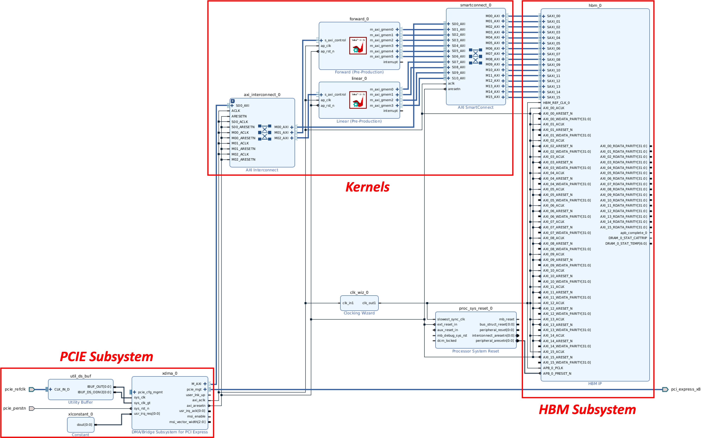
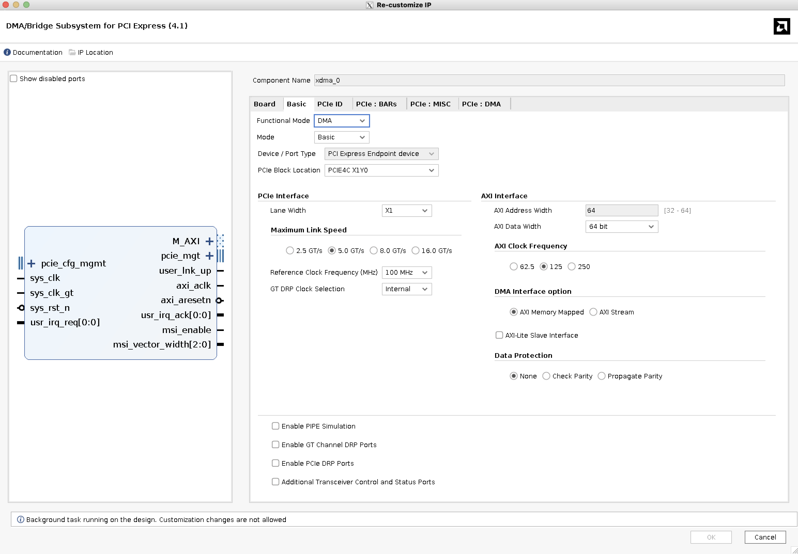
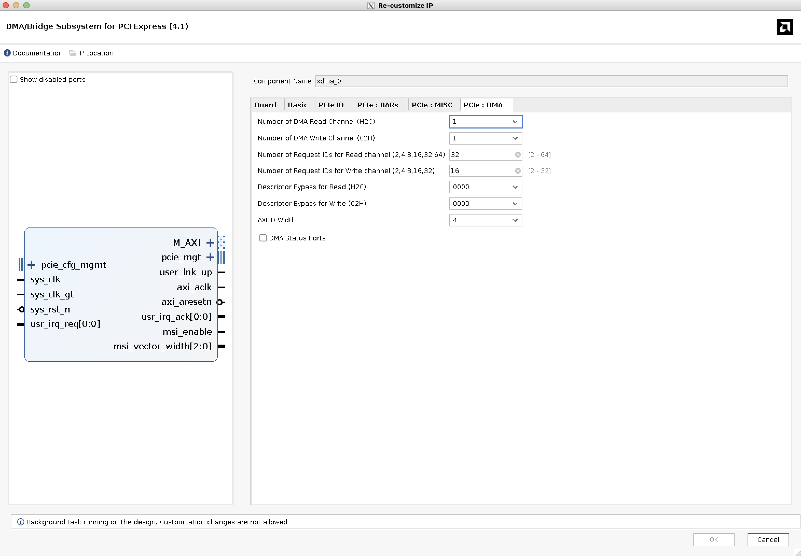
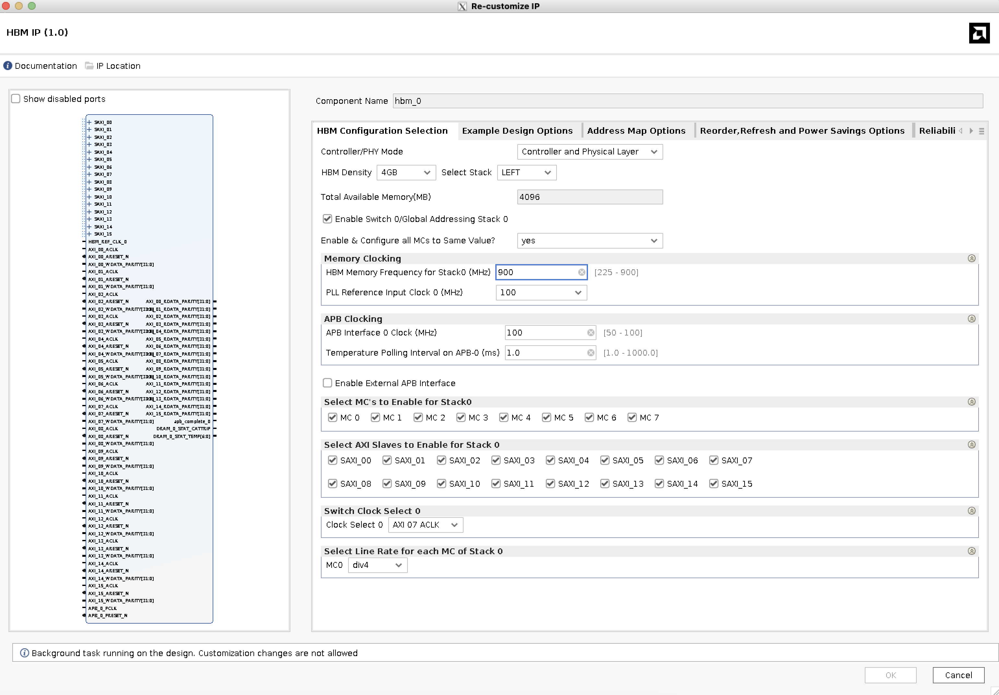
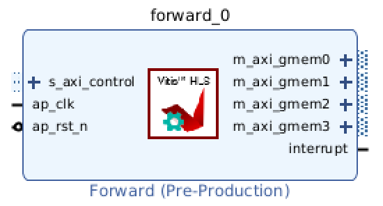
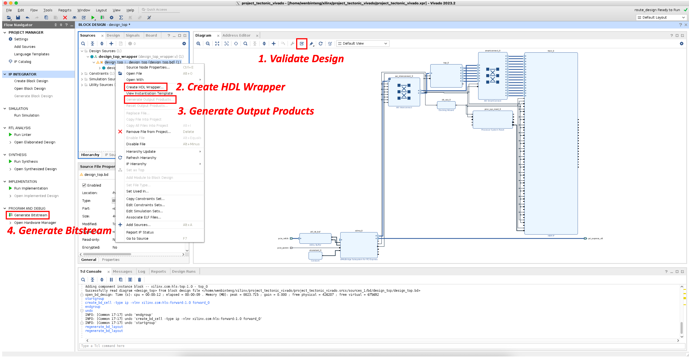
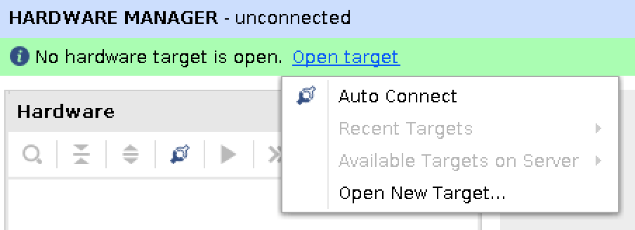
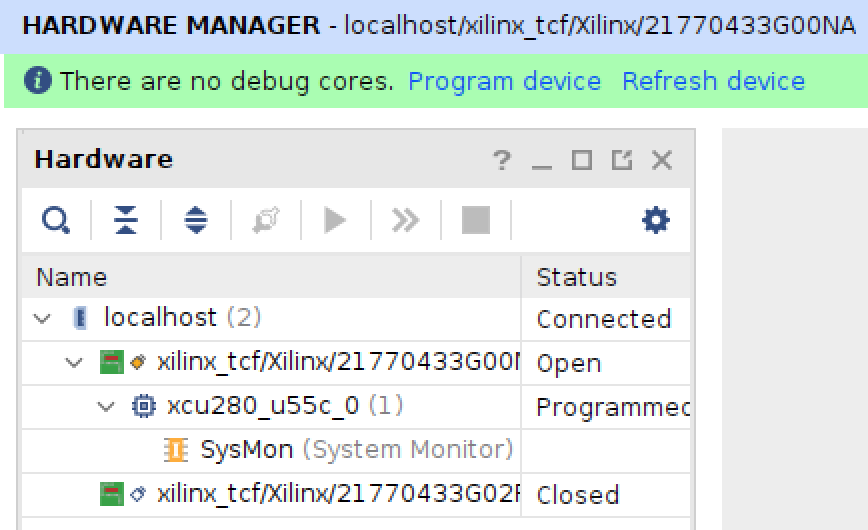

# 如何使用 FPGA 推理大模型 (3) -  硬件平台搭建

在上一部分中，我们已经完成了加速核心的编写，并通过 Vitis-HLS 将其综合为可以被 Vivado 使用的 IP。本部分将重点介绍如何在 Vivado 中搭建完整的硬件平台。

### 1. 平台概览

在进行具体的 IP 配置之前，我们首先看一下 FPGA 硬件平台的整体结构，如下图所示。

可以看到，硬件平台主要分为三个部分：

- PCIE 子系统：负责主机与 FPGA 的通信；
- HBM 子系统：负责处理主机和HBM、加速核心和HBM之间的数据传输和数据存储；
- 加速核心：执行具体的推理计算。

下面，我们将分别从这三个部分讲述如何搭建硬件平台。

（下面的内容需要读者熟悉 Xilinx Vivado 的操作流程。Vivado 的使用不在本博客的讨论范围，操作手册请参考 Xilinx UG908。）

### 2. XDMA IP 配置

XDMA 是 Xilinx 提供的用于主机和 FPGA 之间的 PCIe 通信 IP 核。当配置为 DMA 时，主机可以通过内存映射的 AXI 接口访问 FPGA 上的 RTL 逻辑。

在 Vivado 中，我们创建新的 Project，创建新的 Block Design，添加 XDMA IP，具体配置如下图所示。

这里我们采用了最简配置，目的是减少资源占用、减少编译时间。点击 OK 后，再点击 run block automation，选择与上述一致的配置，点击 OK。Vivado 会自动生成与目标板卡匹配的 XDMA IP。

### 3. HBM IP 配置

在一些高性能 FPGA 板卡中，会集成高带宽内存（High Bandwidth Memory，HBM），非常适合存放模型的权重和中间结果。Vivado 提供了专用的 IP，用于管理 FPGA 上的 HBM 资源。

在之前创建的 Block Design 中，我们添加新的 HBM IP，具体配置如下：

### 4. 加速核心配置

我们将上一部分中导出的 IP 进行解压。

接着，在 Vivado 中，Settings → IP → Repository，点击添加我们解压的 IP 文件夹，点击 OK。

然后，我们就可以在创建的 Block Design 中添加自己的加速核心 IP 了。添加后如图所示。

可以看到，导入的 IP 拥有我们定义好的接口：s_axi_control 接口用于主机读写加速核心的控制寄存器，m_axi_gmem_* 接口用于加速核心访问 FPGA 侧的内存（DDR/HBM）。ap_clk 与 ap_rst_n 分别是加速核心的时钟信号和复位信号。interrupt 是加速核心向主机发出的中断信号。

### 5. 在 Block Design 中完成系统连接

添加了所有必要的 IP 之后，我们就可以进行 IP 之间的连接。按照通信的需求，主要有以下三种连线：

- 主机控制加速核心：XDMA → AXI Interconnect → Kernel S-AXI-Lite
- 主机读写内存：XDMA → AXI Interconnect → Smartconnect → HBM
- 加速核心读写内存：Kernel M-AXI → Smartconnect → HBM

具体连线如第一张图所示。

### 6. 编译并生成比特流

在 Block Design 中执行 Validate Design。

在源文件窗口中，对创建的 Block Design，右键执行 Create HDL Wrapper，再右键执行 Generate Output Products。

在 Project Manager 中直接点击 Generate Bitstream，Vivado 会自动运行生成比特流的必要流程。

### 7. 烧录 FPGA

比特流生成完成之后，点击 Open Hardware Manager，点击 Auto Connect。识别出连接到主机上的 FPGA 设备后，点击 Program Device。选择编译生成的比特流（默认位置在 `<project>/<project>.runs/impl_1/<design_wrapper>.bit`），开始烧写。

---

至此，我们已经完成了硬件平台的搭建，并将编译生成的比特流烧写到 FPGA 设备中。在下一部分中，我们将在这个 FPGA 上进行大模型推理的加速。

