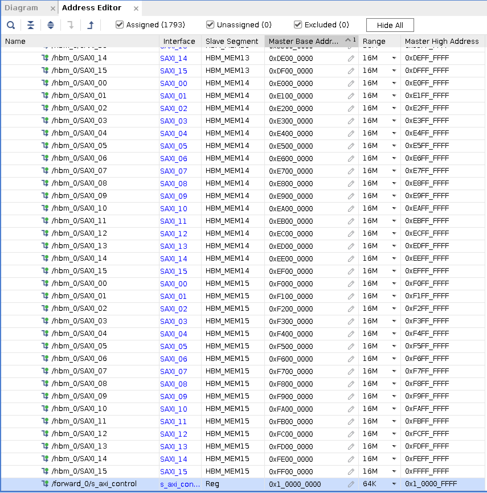
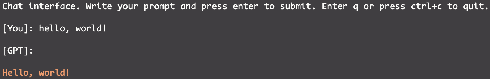

# 如何使用 FPGA 推理大模型 (4) -  运行推理

在上一部分中，我们已经完成了硬件平台的搭建，并成功地将包含加速核心的比特流烧写进 FPGA 中。现在，FPGA 已经具备了执行加速计算的能力。

本部分将重点介绍如何在主机端搭建推理框架，并调用 FPGA 对其中的计算进行加速。


### 1. 搭建推理框架

推理框架是对模型推理过程作专门优化的工具套件。主流的大模型推理框架有 vLLM、Ollama、llama.cpp、SGLang、TensorRT-LLM 等。但是，这些框架对不同的模型、不同的场景、不同的推理设备等做了大量的优化，代码体量大，学习门槛较高。

因此，出于教学目的，这里我们参考了一个轻量级的推理框架：[minichatgpt.cpp](https://github.com/iangitonga/minchatgpt.cpp)，它拥有以下特性：

- **纯 C++ 实现，不依赖外部库**；
- 代码结构清晰，易于理解；
- 算子实现简单，易于替换。

我们只需要编译并运行 minichatgpt.cpp 就可以在命令行中实现对话。

我们在 `model.h` 文件中可以概览整个模型的推理流程：

```c++
Tensor GPT2::logits(const Tensor &inp)
{
    Tensor logits = res_.forward(wte_.forward(inp), wpe_.forward(inp.size(0)));
    for (auto &block : blocks_)
        logits = block.forward(logits);
    logits = ln_f_.forward(logits);
    logits = wte_.forward_proj(logits);

    return logits;
}
```

推理过程为以下几个模块的前向传输：token embedding + position embedding → 24 * transformer blocks → final layer norm → output projection.

我们需要对其中的 transformer blocks 的 MHSA 与 FFN 模块进行加速。下面我们将介绍如何将相应推理代码替换为 FPGA 后端实现。


### 2. 编写 FPGA 后端

在推理框架后端引入 FPGA，需要完成的功能有：(1) 控制 FPGA 中加速核心的运行状态、(2) 向 FPGA 侧的内存中搬运输入和输出张量，(3) 向 FPGA 侧的内存中搬运模型的权重。下面，我们将对这些关键代码进行介绍。

##### 2.1 FPGA 设备读写接口

在上一篇博客中我们已经讲述了如何在主机端加载 FPGA 的 PCIe 设备。在 XDMA 驱动成功加载之后，Linux 系统会在 `/dev` 目录下生成一组设备文件，用于表示主机与 FPGA 之间的不同数据通道。其中：

- `/dev/xdma0_h2c_0` 表示 **Host-to-Card（H2C）** 通道，用于将数据从主机发送到 FPGA；
- `/dev/xdma0_c2h_0` 表示 **Card-to-Host（C2H）** 通道，用于将数据从 FPGA 读回主机。

在用户态程序中，我们首先通过 Linux 提供的 `open` 函数打开这些设备文件，并获得对应的文件描述符。此时，这些文件描述符就代表了一条已经建立的 PCIe 数据通路。

在 FPGA 内部，连接到 XDMA 的不同组件会被映射到不同的地址空间中。用户态程序可以通过 `lseek` 函数来将“文件指针”移动到目标地址，即可以对 FPGA 中对应的组件进行操作。

完成地址定位之后，就可以使用 Linux 下的 `read` 和 `write` 函数对 FPGA 进行读写。在底层，这些函数调用会被 XDMA 驱动转换为 PCIe DMA 事物，实现数据的搬运。

这里给出我们实现的 FPGA 读写功能实现，完整代码请参考仓库。

```c++
constexpr size_t RW_MAX_SIZE = 0x7ffff000;
const char *C2H[4] = {"/dev/xdma0_c2h_0","/dev/xdma0_c2h_1","/dev/xdma0_c2h_2","/dev/xdma0_c2h_3"};
const char *H2C[4] = {"/dev/xdma0_h2c_0","/dev/xdma0_h2c_1","/dev/xdma0_h2c_2","/dev/xdma0_h2c_3"};

int dmaRead(int fd, char *buffer, uint64_t size, uint64_t addr) {
    if (addr != lseek(fd, addr, SEEK_SET))
        return -1;
    if (size != read(fd, buffer, size))
        return -1;
    return 0;
}

int dmaWrite(int fd, char *buffer, uint64_t size, uint64_t addr) {
    if (addr != lseek(fd, addr, SEEK_SET))
        return -1;
    if (size != write(fd, buffer, size))
        return -1;
    return 0;
}

void readFpga(void *varPtr, uint64_t size, uint64_t addr) {
    int fpgaFd = -1;
    char *buffer = nullptr;
    size_t pageSize = sysconf(_SC_PAGESIZE);

    fpgaFd = open(C2H[0], O_RDWR);
    assert(fpgaFd >= 0);

    posix_memalign(reinterpret_cast<void **>(&buffer), pageSize, size + pageSize);
    assert(buffer != nullptr);

    int r = dmaRead(fpgaFd, buffer, size, addr);
    assert(r == 0);
    memcpy(varPtr, buffer, size);
    close(fpgaFd);
    free(buffer);
}

void writeFpga(void *varPtr, uint64_t size, uint64_t addr) {
    int fpgaFd = -1;
    char *buffer = nullptr;
    size_t pageSize = sysconf(_SC_PAGESIZE);

    fpgaFd = open(H2C[0], O_RDWR);
    assert(fpgaFd >= 0);

    posix_memalign(reinterpret_cast<void **>(&buffer), pageSize, size + pageSize);
    assert(buffer != nullptr);

    memcpy(buffer, varPtr, size);
    int r = dmaWrite(fpgaFd, buffer, size, addr);
    assert(r == 0);
    close(fpgaFd);
    free(buffer);
}
```

##### 2.2 加速核心控制接口

在硬件平台中，我们将加速核心的接口定义为 AXI-Lite，并连接到 XDMA 与主机进行通信。在 Block Design 的地址编辑窗口中，我们可以看到分配的地址为 `0x1_0000_0000`。



我们使用上述的 FPGA 读写接口就可以向加速核心的控制寄存器写入控制命令。在 Xilinx UG1399 中，我们可以看到，Vitis-HLS 默认将自动推导控制信号并映射到以下偏移地址：

- `0x00`：IP 控制信号
- `0x10`：参数 a 
- `0x18`：参数 b
- ...

具体而言，通过读写 `0x1_0000_0000`+`0x00` 地址处的内容，可以控制 IP 的状态，通过写入 `0x1_0000_0000`+`0x10` 地址处的内容，可以向加速核心（gmem0 bundle）传递参数 a（数组指针/起始地址），以此类推。

对于控制信号的定义，官方文档给出这样的定义：

- `bit0`：ap_start
- `bit1`：ap_done
- `bit2`：ap_idle
- `bit3`：ap_ready
- `bit4`：ap_continue
- `bit7`：auto_restart
- `bit9`：interrupt
- `reserved`

因此，我们向 `0x1_0000_0000`+`0x00` 地址写入 `0x01` 就可以启动 IP，向 `0x1_0000_0000`+`0x00` 地址读取第 4 位就可以得知 IP 是否运行就绪，等等。

这里我们给出启动 IP 与判断 IP 是否就绪的功能实现，完整的代码请参考仓库。

```c++
void start(XHlsIp *ipInstPtr) {
    assert(ipInstPtr != nullptr);
    
    uint32_t data;
    FpgaConfig::readFpga(reinterpret_cast<void*>(&data), 4,ipInstPtr->controlBaseAddr + XHLS_IP_CONTROL_ADDR_AP_CTRL);

    data = (data & 0x80) | 0x01;
    FpgaConfig::writeFpga(reinterpret_cast<void*>(&data), 4, ipInstPtr->controlBaseAddr + XHLS_IP_CONTROL_ADDR_AP_CTRL);
}

uint32_t isReady(XHlsIp *ipInstPtr) {
    assert(ipInstPtr != nullptr);
    
    uint32_t data;
    FpgaConfig::readFpga(reinterpret_cast<void*>(&data), 4, ipInstPtr->controlBaseAddr + XHLS_IP_CONTROL_ADDR_AP_CTRL);

    return (data >> 3) & 0x01;
}
```

##### 2.3 搬运输入输出张量以及模型权重

我们已经知道，GPT-2 Medium 模型的参数量为 355 M 个。我们采用的是 Float16 数据类型，每个参数占用 2 个字节，则模型参数大小为 710 MB。本硬件实验平台使用的是 Xilinx Alveo U280 板卡，具备 8 GB HBM。因此所有的权重可以**提前**放置在 FPGA 侧的内存中。

我们在模型加载时同步地将 MHSA 和 FFN 层的权重放置到 HBM 中，我们还实现了一个地址分配器来自动地为每一层的权重分配 HBM 内存地址。在执行推理时，就不需要重复地搬运这些权重，加快推理速度。

由于我们只实现了 MHSA 和 FFN 的加速核心，一个 Transformer 块内部的 LayerNorm 与 Residual 需要在 CPU 上执行。token 在 Transformer 块内部的数据传输流程是这样的：prev block → LayerNorm (CPU) → MHSA (FPGA) → Residual (CPU) → LayerNorm (CPU) → FFN (FPGA) → Residual (CPU) → next block. 

我们使用前述的 DMA 接口来完成这一个过程。


### 3. 运行推理

在完成推理框架后端的集成后，我们执行编译，然后运行可执行文件 minichatgpt，就可以在命令行中进行对话。



