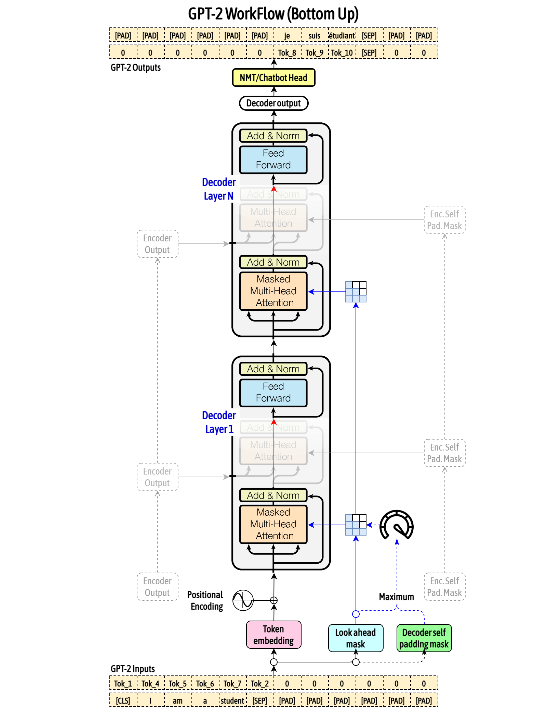

# 如何使用 FPGA 推理大模型 (2) -  加速核心编写

在这一部分中，我们将重点介绍如何在 FPGA 上编写**加速核心**，以加速大模型推理过程中最关键的计算环节。

与在 CPU 上通过指令顺序执行程序不同，FPGA 的核心优势在于可以将计算过程直接“固化”为硬件结构，从而实现高度并行的执行方式。针对特定计算任务进行的硬件定制，正是 FPGA 能够获得加速效果的根本原因。

在具体实现上，我们将首先借助高层次综合工具（HLS）来描述计算逻辑，这些描述最终会被综合并映射为 FPGA 上真实运行的硬件电路。随后，通过预先定义好的接口，软件可以像调用普通函数一样触发这些加速核心完成计算。本篇博客将围绕这一完整流程展开，逐步讲解加速核心的编写思路，帮助读者建立对 FPGA 加速流程的整体认识。


### 1. GPT-2 模型概览

GPT-2 模型是 OpenAI 发布的基于 Transformer Decoder 架构的大语言模型，提供 small-124M、medium-355M、large-774M、xl-1.5B 四种参数规模。



这里我们选择 GPT-2 Medium 作为加速对象，其结构以及各级参数如下所示：

```bash
Model: GPT-2 Medium (355M)
├── Token Embedding: 50257 × 1024
├── Position Embedding: 1024 × 1024
├── 24 Transformer Blocks
│   ├── LayerNorm
│   ├── Multi-Head Attention (16 heads, 64 dim each)
│   │   ├── Q: Linear(1024 → 1024)
│   │   ├── K: Linear(1024 → 1024)
│   │   ├── V: Linear(1024 → 1024)
│   │   └── Output: Linear(1024 → 1024)
│   ├── Residual: Add & Norm
│   ├── LayerNorm
│   ├── Feed Forward Network
│   │   ├── Expansion: Linear(1024 → 4096)
│   │   ├── Activation: GELU
│   │   └── Projection: Linear(4096 → 1024)
│   └── Residual: Add & Norm
├── Final LayerNorm
└── Output Projection: Linear(1024 → 50257)
```

可以看到，Transformer Blocks 在整个模型中的计算占比最大，因此，我们选择其中的多头自注意力层（Multi-Head Attention，MHSA）和前馈网络层（Feed Forward Network，FFN）进行加速。下面简要介绍一下这两个层的作用。

##### MHSA

MHSA 用于根据注意力机制计算当前 token 的上下文增强表示。

> 输入: token (seq_len × embed_dim)
> 输出: token (seq_len × embed_dim)

计算过程的公式为
$$
Q=X W_q + b_q\\
K=X W_k + b_k\\
V=X W_v + b_v\\
\mathrm{Attention}(Q,K,V)=\mathrm{Sofmax}(\frac{QK^T}{\sqrt{d}})V
$$

##### FFN

FFN 用于对 token 进行非线性变化。

> 输入: token (seq_len × embed_dim)
> 输出: token (seq_len × embed_dim)

计算过程的公式为
$$
\mathrm{FFN}(X) = \mathrm{GELU}(XW_1+b_1)W_2+b_2
$$


### 2. 使用 Stream-HLS 框架生成代码

对于初学者而言，直接使用 HDL 或传统 HLS 编写加速核心往往门槛较高，且开发周期较长。这里我们介绍一个最新的基于 MLIR 的 HLS 代码生成框架：[Stream-HLS](https://github.com/UCLA-VAST/Stream-HLS/tree/main)，它可以将输入的 Pytorch 模型转换为 HLS 代码，并拥有不错的性能。

##### 2.1 安装

克隆仓库，并按照仓库中 README 安装步骤进行安装。

##### 2.2 编写加速核心

我们对仓库中原有的 MHSA 和 FFN 模型定义进行修改，以匹配 GPT-2 的模型参数和输入大小。

首先，MHSA 的代码 `examples/pymodels/transformers/MultiHeadSelfAttention.py` ：

```python
# MultiHeadSelfAttention.py

import math
import torch
import torch.nn as nn
import torch.nn.functional as F

class MultiHeadSelfAttention(nn.Module):
    def __init__(self, embed_dim, num_heads):
        super(MultiHeadSelfAttention, self).__init__()
        assert embed_dim % num_heads == 0
        self.num_heads = num_heads
        self.head_dim = embed_dim // num_heads
        
        self.c_attn = nn.Linear(embed_dim, 3*embed_dim, dtype=torch.float16)
        self.c_proj = nn.Linear(embed_dim, embed_dim, dtype=torch.float16)
        
    def forward(self, x):
        batch_size, seq_length, embed_dim = x.shape
        
        qkv = self.c_attn(x)
        q,k,v = torch.split(qkv, embed_dim, dim=2)
        
        q = q.view(batch_size, seq_length, self.num_heads, self.head_dim).transpose(1, 2)
        k = k.view(batch_size, seq_length, self.num_heads, self.head_dim).transpose(1, 2)
        v = v.view(batch_size, seq_length, self.num_heads, self.head_dim).transpose(1, 2)
        
        score = (q @ k.transpose(-2,-1)) / math.sqrt(self.head_dim)  # (batch_size, num_heads, seq_length, seq_length)
        tri = torch.ones(seq_length, seq_length, dtype=torch.bool).tril()
        score = score.masked_fill(~tri, float("-inf"))
        
        attn = F.softmax(score, dim=-1)
        y = attn @ v  # (batch_size, num_heads, seq_length, head_dim)
        y = y.transpose(1,2).contiguous().view(y.size(0), y.size(2), -1)  # (batch_size, seq_length, embed_dim)
        out = self.c_proj(y)
        
        return out

```

然后，修改 FFN 的代码 `examples/pymodels/transformers/FeedForward.py`：

```python
# FeedForward.py

import torch
import torch.nn as nn

class FeedForward(nn.Module):
    def __init__(self, embed_dim, ff_dim):
        super(FeedForward, self).__init__()
        self.fc1 = nn.Linear(embed_dim, ff_dim, dtype=torch.float16)
        self.fc2 = nn.Linear(ff_dim, embed_dim, dtype=torch.float16)
        self.gelu = nn.GELU()

    def forward(self, x):
        x = self.gelu(self.fc1(x))
        x = self.fc2(x)
        return x
```

最后，在 `examples/data.py` 中修改输入向量的大小：

```json
"FeedForward" : {
  "class": "FeedForward",
  "config" : dict(
    embed_dim=1024,
    ff_dim=4096
  ),
  "input" : (
    randTensor(1, 128, 1024, dtype=dtype),
  )
},
"MultiHeadSelfAttention" : {
  "class": "MultiHeadSelfAttention",
  "config" : dict(
    embed_dim=1024,
    num_heads=16
  ),
  "input" : (
    randTensor(1, 128, 1024, dtype=dtype),
  )
}
```

##### 2.3 运行

在 bash 中配置环境变量：

```bash
export PATH="$PWD/build/bin:$PATH"
export XILINX_HLS="/tools/Xilinx/Vitis_HLS/2023.2/"
```

在 `examples` 目录中运行 Stream-HLS 脚本以生成 HLS 代码：

```bash
python run_streamhls.py -b transformers -k FeedForward -O5
python run_streamhls.py -b transformers -k MultiHeadSelfAttention -O5
```

其中，`-b` 用于指定 benchmark 目录，`-k` 用于选择需要编译的 kernel，`-O` 是优化级别选项。

执行完毕后， `examples/designs/transformers/opt5/<KERNEL>_7680/<KERNEL>/hls/src/<KERNEL>.cpp` 就是生成的 HLS 代码。

##### 2.4 微调代码

此时生成的 HLS 代码还无法直接用于 Vivado Flow，需要进行少量人工修改，以适配后续的系统集成流程。

**绑定 AXI 接口**

Stream-HLS 默认生成的顶层接口为数组形式，这种接口通常对应 FPGA 片上存储资源。为了支持主机与 FPGA 之间的数据传输，需要将这些接口绑定到 AXI 接口上。

在生成的 HLS 代码文件中，找到 `forward` 函数，这是顶层函数定义。在函数体头部添加以下接口约束：

```c++
#pragma HLS interface mode=m_axi offset=slave port=<name> bundle=gmem<number> max_widen_bitwidth=256
...
```

将 `<name>` 替换为实际的数组名称，如 `v99`。将 `<number>` 设置为不同的数字，以区别不同的 AXI 接口。所有数组接口都应该添加上述的接口约束。

**添加 AXI-Lite 控制接口**

为了便于主机端对加速核心进行控制（例如启动和结束计算），还需要为顶层函数添加 AXI-Lite 控制接口。

同样地，在 `forward` 函数体的头部，添加以下代码：

```c++
#pragma HLS interface mode=s_axilite port=return
```

**删除数组分块约束**

Stream-HLS 会为数组接口自动添加 `array_partition` 约束，以提高并行访存能力。但在绑定到 AXI 接口后，这种分块方式会导致接口数量急剧增加，增加系统集成复杂度。因此，需要删除 `forward` 及相关 `node*` 函数中针对数组接口的 `array_partition` 约束。


### 3. Vitis-HLS 综合

在 `examples/designs/transformers/opt5/<KERNEL>_7680/<KERNEL>/hls` 中，Stream-HLS 已经为加速核心生成了 Vitis-HLS 综合所需的脚本。我们需要执行的是 syn 流程，然后导出 Vivado Flow 使用的 IP。以下是综合的流程：

首先，在 `hls.tcl` 脚本中添加导出 IP 的命令 `export_design`：

```bash
...
elseif {[lindex $argv 1] == "syn"} { 
  # config_op fmacc -impl auto -precision high
  csynth_design
  # add this command
  export_design -rtl verilog -format ip_catalog -output ./
}
...
```

这条命令将会创建基于 RTL 的 IP，可以在 Vivado Flow 中导入。

接着，在终端中执行综合脚本：

```bash
bash syn.batch
```

可以看到，生成的 IP 压缩包在当前路径下。


---

至此，我们已经完成了加速核心的编写以及基于 Vitis-HLS 的综合流程。在下一部分中，我们将把这些 IP 导入 Vivado 工程，搭建完整的 FPGA 硬件实验平台，并完成与主机端软件的集成。

